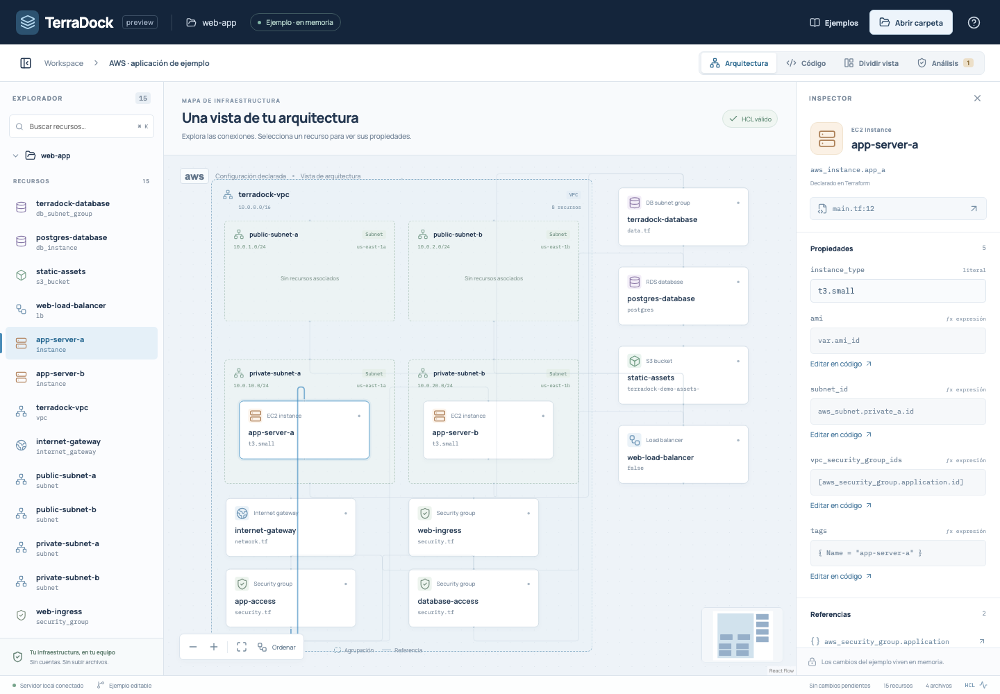

# TerraDock

**Tu infraestructura, conectada con su código.**

TerraDock es un IDE visual de Terraform que funciona en tu equipo. Abre una carpeta, explora los recursos y sus relaciones, y navega entre el diagrama, el editor y las propiedades. Un servidor local en Go interpreta HCL y sirve la interfaz React en el navegador.

Esta entrega es una **demo funcional en desarrollo**. Su alcance y sus límites están publicados; el [roadmap de v1.0](docs/roadmap.md) describe trabajo futuro, no una lista de capacidades ya terminadas.



## Probar la demo

Requisitos para compilar: **Go 1.25 o superior**, **Node.js 24**, npm y Make. La primera instalación descarga dependencias. No necesitas Terraform ni credenciales AWS para analizar los ejemplos.

```sh
git clone https://github.com/RenzoAL7/TerraDock.git
cd TerraDock
make install
make build
make run
```

Abre [http://127.0.0.1:7331](http://127.0.0.1:7331). Prueba el ejemplo de la interfaz o pulsa **Abrir carpeta** para elegir una configuración local. El directorio desde el que arrancas el programa delimita la navegación disponible.

Para trabajar con otra carpeta:

```sh
./bin/terradock --root /ruta/a/tus/proyectos --assets ./web/dist --port 7331
```

`--root` define el directorio permitido para abrir proyectos; `--assets` apunta al frontend compilado. El proceso escucha en loopback. Para detenerlo, pulsa `Ctrl+C` en su terminal. Mantén `bin/terradock` y `web/dist` si mueves la aplicación; esta entrega todavía no empaqueta el frontend en un único ejecutable.

## Qué puedes explorar

- Un espacio de trabajo con explorador, código, arquitectura e inspector.
- Recursos declarados en los archivos `.tf` del módulo seleccionado y relaciones extraídas de sus referencias.
- Navegación desde un recurso hasta su bloque de origen.
- Edición de código y de propiedades literales compatibles.
- Diagnósticos de sintaxis y estados explícitos de guardado.
- Dos ejemplos editables en memoria para experimentar con la interacción entre código y gráfico.
- Observación de cambios externos y protección contra guardados obsoletos.

El diagrama representa **configuración declarada**. No acredita infraestructura desplegada ni predice acciones de un plan. Las expresiones que requieren contexto de Terraform se conservan sin inventar valores. Consulta la [matriz de compatibilidad y limitaciones](docs/limitations.md) antes de usar un proyecto real.

## Desarrollo

Ejecuta estos comandos en dos terminales desde la raíz del repositorio:

```sh
# Terminal 1: API local
make dev-api
```

```sh
# Terminal 2: frontend con recarga
make dev-web
```

Abre [http://127.0.0.1:5173](http://127.0.0.1:5173). Vite reenvía `/api` al servicio Go; `make dev-api` autoriza ese origen de desarrollo. En el build local, Go sirve ambos desde el mismo puerto.

```sh
make check       # Formato, análisis estático y tipos
make test        # Pruebas Go y frontend
make e2e-install # Instalar Chromium de Playwright una vez
make e2e         # Flujos de navegador con servicios de prueba
```

La [guía de desarrollo](docs/development.md) explica la estructura, la estrategia de pruebas y el flujo de ramas.

## Estructura

```text
TerraDock/
├── cmd/terradock/       # Entrada del programa y opciones de arranque
├── internal/           # Parser HCL, modelo y servicio HTTP
├── examples/           # Configuraciones Terraform de demostración
├── web/
│   ├── src/            # Interfaz React, editor y canvas
│   ├── tests/          # Flujos de navegador
│   └── package.json    # Dependencias y tareas del frontend
├── docs/               # Arquitectura, desarrollo, límites y roadmap
├── scripts/            # Comprobaciones de desarrollo compartidas
├── .github/            # CI y plantilla de pull request
├── Makefile            # Entrada común a build, desarrollo y pruebas
└── CONTRIBUTING.md     # Convenciones para contribuir
```

Las pruebas Go viven junto al código que verifican; las pruebas del frontend acompañan sus módulos y los escenarios de navegador están separados. No es necesario copiar el código a una carpeta de “pruebas”.

## Contribuir

`main` es la rama de integración estable. Cada cambio se desarrolla en una rama corta, por ejemplo `codex/interactive-demo`, y se revisa mediante pull request después de pasar CI. La política completa está en [CONTRIBUTING.md](CONTRIBUTING.md).

- [Arquitectura](docs/architecture.md)
- [Desarrollo y pruebas](docs/development.md)
- [Evidencia de validación de la demo](docs/validation.md)
- [Compatibilidad y límites](docs/limitations.md)
- [Roadmap del producto](docs/roadmap.md)

## Licencia

[MIT](LICENSE).
