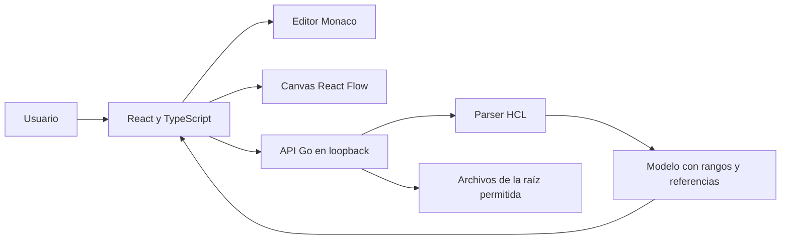

# Arquitectura de la demo

TerraDock mantiene el proyecto en el equipo del usuario. El navegador presenta el editor y el diagrama; Go controla el acceso a archivos e interpreta Terraform con las bibliotecas HCL de HashiCorp. El frontend compilado se sirve junto a la API.

## Responsabilidades

| Capa | Responsabilidad | Límite |
| --- | --- | --- |
| `cmd/terradock` | Opciones de arranque y servidor HTTP | No contiene lógica de interpretación |
| `internal/` | Modelo, interpretación, acceso al proyecto y API | No ejecuta Terraform ni consulta AWS |
| `web/src/` | Navegación, borradores, editor, canvas e inspector | El diagrama se deriva del modelo interpretado |
| `examples/` | Entradas didácticas para probar el flujo | No son un despliegue verificado |
| `web/tests/` | Escenarios de usuario sobre servicios locales | No validan recursos en AWS |

## Modelo de Terraform

El análisis considera los `.tf` del directorio seleccionado como un módulo raíz. Cada recurso conserva su dirección, tipo, nombre y ubicación de origen. Las relaciones se extraen de referencias presentes en las expresiones; sus etiquetas y direcciones deben poder justificarse desde el código.

El parser interpreta sintaxis HCL. No sustituye el motor de evaluación de Terraform ni los esquemas de los proveedores. Los bloques con `count` o `for_each` son declaraciones; no se expanden a un número inventado de instancias. Los valores dependientes de variables, funciones o proveedores se mantienen como expresiones.

La edición desde el inspector se restringe a los literales reconocidos. Una operación debe apuntar al rango de la expresión original y verificar la revisión antes de escribir. El código no editado visualmente conserva su contenido. El [documento de limitaciones](limitations.md) delimita las garantías de esta demo y lo que falta para la edición fiable prevista en el roadmap.

## Dos contextos de trabajo

La interfaz permite explorar una demostración y abrir un proyecto local. El contexto activo debe ser visible. Las operaciones sobre un ejemplo temporal no deben hacerse pasar por una modificación de una carpeta del usuario.

En modo local, `--root` delimita el espacio accesible. Abrir una carpeta selecciona el módulo que se analizará dentro de esa raíz. No se agrega recursivamente cualquier `.tf` encontrado: cada módulo mantiene su contexto.

## Contrato de la API local

`GET /api/session` devuelve el token de sesión, `instanceId`, raíz permitida, modo y versión. Las mutaciones requieren `Content-Type: application/json` y el encabezado `X-TerraDock-Session`. El servidor comprueba el host de loopback y el origen; la excepción de desarrollo admite únicamente el origen exacto configurado y no habilita CORS.

| Petición | Datos relevantes |
| --- | --- |
| `GET /api/project` | Snapshot del proyecto activo |
| `GET /api/directories?path=...` | Directorios navegables dentro de la raíz |
| `POST /api/demo` | `template`: `basic-vpc` o `web-app`; abre una copia en memoria |
| `POST /api/open` | `path`: carpeta del módulo raíz |
| `PUT /api/files` | `projectId`, `path`, `content`, `expectedRevision` |
| `PATCH /api/properties` | `projectId`, `resourceId`, `property`, `value`, `expectedRevision` |
| `GET /api/events` | Stream SSE con eventos `project` y snapshots completos |

La revisión esperada corresponde al hash del archivo de origen, también para editar una propiedad. El servidor verifica `projectId` bajo el mismo bloqueo que el guardado; una operación destinada al proyecto anterior recibe `409 project_conflict`, incluso cuando los dos proyectos contienen archivos con el mismo nombre y contenido. Una revisión obsoleta recibe `409 revision_conflict`. Las respuestas de error incluyen `code` y `error`.

## Orden de actualizaciones y borradores

Cada snapshot incluye `instanceId` y `sequence`. `instanceId` es un identificador público aleatorio de la instancia del gestor, independiente del token de autenticación. `sequence` aumenta con cada actualización publicada, incluido cambiar de ejemplo o carpeta, los errores de lectura y su recuperación. Cambiar de proyecto no reinicia la secuencia; iniciar otro proceso genera una identidad nueva.

HTTP y SSE pueden llegar en un orden distinto al de las operaciones. El cliente confirma la identidad mediante `/api/session` y compara las secuencias dentro de esa instancia para evitar que una respuesta tardía sustituya una vista más reciente. La respuesta concreta de un guardado conserva la revisión que produjo esa operación; una actualización posterior de otro cliente no autoriza a rebasar automáticamente un borrador sobre ella.

El servidor comparte un proyecto activo entre sus pestañas. Los borradores pertenecen a cada pestaña y conservan el proyecto y revisión desde los que comenzaron. Si una modificación deja HCL inválido, se muestran la nueva fuente y sus diagnósticos mientras el gráfico conserva la última configuración válida del proyecto. La observación de cambios externos se realiza mediante lectura periódica cada 500 ms; no supone un plazo máximo de actualización garantizado.

## Desarrollo y build

Durante el desarrollo, Vite sirve el frontend en `127.0.0.1:5173` y reenvía la API al proceso Go en `127.0.0.1:7331`. `make dev-api` permite el origen exacto de Vite mediante `--dev-origin`; esa excepción es opcional y no se necesita para el build. Durante la ejecución del build, Go sirve los archivos de `web/dist` y la API desde un mismo puerto. Monaco y sus workers se incluyen en la compilación del frontend.

La distribución inicial consiste en un ejecutable y un directorio de assets. El empaquetado de un único archivo, los instaladores y las actualizaciones automáticas son trabajo posterior.

## Decisiones deliberadas

- La interfaz corre en el navegador para evitar un runtime de escritorio adicional.
- Go comparte la responsabilidad del servidor y el análisis HCL para mantener las operaciones de archivos fuera del navegador.
- El diseño visual y el código se sincronizan mediante un modelo común con origen verificable.
- El estado de despliegue, la importación de planes y las operaciones Terraform quedan fuera de esta entrega.
- Se publica compatibilidad parcial antes de ampliar recursos o evaluación semántica.

Referencias técnicas: [HCL](https://github.com/hashicorp/hcl), [módulos Terraform](https://developer.hashicorp.com/terraform/language/files), [Monaco Editor](https://github.com/microsoft/monaco-editor) y [React Flow](https://reactflow.dev/).
